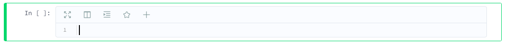
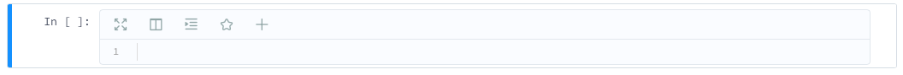
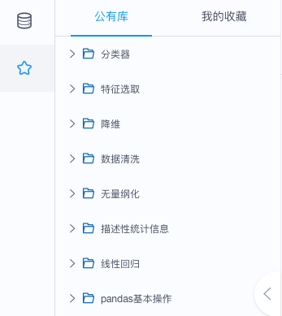

# Notebook(编程环境)
Notebook是用户打开K-Lab后，在浏览器端所看到的交互式编程界面。

Jupyter Notebook定义的基于web的交互式编程方法已经逐渐成为全球数据科学领域的前端标准。K-Lab在Notebook这种交互范式的基础上，进一步优化了数据分析的工作流程，为数据工作者提供了一个简洁友好、功能丰富的在线数据分析界面。

K-Lab Notebook由**Header**、**Code Cell**、**Markdown Cell**、**侧边栏**和及**监控区**组成。
***
## Header
Header包含了菜单栏、工具栏与kernel状态。用户在编辑Notebook时Header会一直保持在页面顶端。
 

**菜单栏**
* **文件**：对整体项目文件的操作
* **编辑**：对cell单元的操作
* **查看**：对不同视图模块的显示操作
* **运行**：不同形式的cell运行命令
* **Kernel**：对kernel的操作指令
* **帮助**：K-Lab相关的使用帮助

**工具栏**
工具栏中提供了数据分析过程的常用操作按钮。

**Kernel状态**
在工具栏右侧会显示当前的kernel类型与kernel状态，当圆圈为空心时代表kernel空闲，当圆圈为实心时代表kernel忙碌。

## Code Cell
Code Cell是Notebook的代码编写单元。用户在Code Cell内编写代码（目前K-Lab支持**Python2**、**Python3**和**R**等主流编程语言），代码由后端的Kernel运行，并返回结果到Code Cell。通过这样一个工作流，用户来**解决数据分析中如数据导入、模型搭建、数据可视化、参数调优等问题**。    

Code Cell有**编辑模式**和**命令模式**两种状态，状态可以相互切换：编辑模式下，按`Enter`键进入命令模式；命令模式下，按`Esc`键进入编辑模式。

* **编辑模式**：表示该cell允许被编辑，界面上显示cell单元框线为绿色，即用户可以在cell中键入代码或注释。
 

* **命令模式**：表示该cell允许被执行，界面上显示cell的单元框线为蓝色，即用户可以通过点击`运行`按钮或快捷键`Shift + Enter`来运行cell。
  

**Code Celll工具栏**：K-Lab的Code cell支持独有的沉浸模式，美化代码，代码片段功能，提高用户的代码编写效率。
* **沉浸模式**：K-Lab Code cell支持在沉浸模式下编写代码，让用户更专注于数据分析工作，不受打扰。
*  **美化代码**：K-Lab提供基于通用的PEP 8 规范的python代码美化，提升代码可读性。
* **代码片段**：K-Lab提供插入和收藏代码片段功能来减少用户在数据分析过程中重复思考和搜索代码的时间。

## Markdown Cell
Markdown Cell是K-Lab的文本编辑单元，用户通过在Markdown Cell中输入Markdown格式的文本，来**完成数据分析中的报告撰写任务**。

K-Lab Makrdown的使用示例，请[参考链接](https://www.kesci.com/static/markdown_guide.html)。

## 侧边栏
K-Lab Notebook侧边栏包含数据文件目录与代码片段两个组件。
### 数据文件目录
当前项目挂载的数据集信息可以在文件目录查看，并支持csv与zip格式的文件内容预览。

### 代码片段
K-Lab提供代码片段功能来提升用户的编程效率，用户可以在该区域进人数据分析常用代码知识库的整理，并在编写代码时快速插入使用。代码片段分为**公有库**和**我的收藏**。
* 公有库：公有库为官方预置的数据分析、机器学习的常用代码。        

* 我的收藏：用户在code cell收藏的的代码片段将在该区域呈现。

## 监控区
用户可以在页面底部的监控区随时查看监控信息和日志，在监控条上可以看到K-lab的可用时间、CPU用量、内存用量、磁盘用量以及工作区状态等。同时用户可以通过查看系统日志的方式来分析运行过程中的异常信息。
