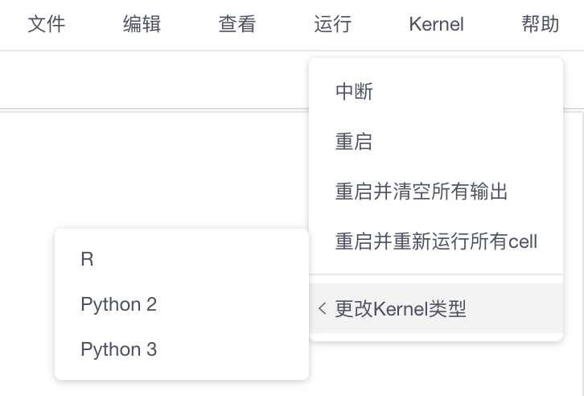
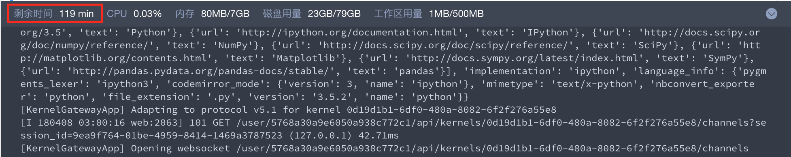

# Kernel(计算环境)
K-Lab在云端为用户管理所有底层基础架构，连接数据、算力、环境，让数据工作者能够避免数据工程问题的困扰。

Kernel是Notebook对应的计算环境。用户挂载数据后，通过Notebook编写代码，在Kernel中运行，从而得到分析结果。

## Kernel类型
K-Lab提供了**Python 2.7.9 & Python 3.5.2** 和 **R 3.3.2** 三种语言版本下的kernel。用户可以根据需求在菜单栏切换不同的kernel。


* 友情提示：科赛建议 Python 用户在 K-Lab 上使用 Python3 进行编程分析。

## Kernel内置工具包
K-Lab kernel中内置各类主流的机器学习、深度学习框架，集成了常见数据分析包，用户可以免除前期环境配置，直接开展分析工作。

K-Lab Kernel支持用户在与Kernel相连的Notebook中输入指令查看、安装和更新工具包。 
### 查看工具包
用户可在Notebook的Code Cell中键入相应指令查看预置的工具包。

* Python3 Kernel
```
!pip list --format=columns  #查看Kernel下所有预置的工具包
```
```
!pip show package_name      #查看Kernel是否有某个工具包
```

* Python2 Kernel    
```
!pip2 list --format=columns  #查看Kernel下所有预置的工具包
```
```
!pip2 show package_name      #查看Kernel是否有某个工具包
```

* R Kernel
```
pkgs <- installed.packages();
pkgs[is.na(pkgs[,"Priority"]), c("Package", "Version")]
```
```
installed.packages('package name')
```

### 安装、升级工具包
用户可在Notebook的Code Cell中键入相应bash指令安装、更新所需要的工具包
* Python3 Kernel
```
!pip install package_name==version #安装python3环境的工具包。不注明version则自动安装最新版本
```
```
!pip install package_name --upgrade #更新python3环境的工具包。
```
* Python2 Kernel
```
!pip2 install package_name==version #安装python2环境的工具包。如果不注明version则自动安装最新版本
```
```
!pip2 install package_name --upgrade #更新python2环境的工具包。
```


* R Kernel
```
install.packages(package_name) #安装R环境的工具包。
```

* 友情提示：
    * 手动安装好工具包后，请刷新页面，刷新后Kernel将完成工具包的更新部署。
    * 用户自行安装的工具包不能被持久化，有持久化需求的工具包，可通过[帮助中心](https://www.kesci.com/apps/home/workspace/help)下的意见反馈向科赛网提出工具包安装需求，我们将在2个工作日内给出答复。


## Kernel计算资源
K-Lab 给每位用户都配置了独享云计算资源。

为了让计算资源有效分配，将限制用户单次使用时长，超过使用时长 Kernel 将自动断开，用户可以通过刷新手动连接 Kernel 分配到新的计算资源，继续开展分析工作。

用户可以在监控区查看剩余使用时长与计算资源使用情况。

