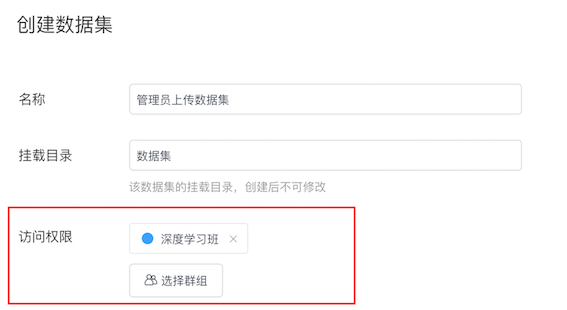

# 数据集
K-Lab组织版的数据集分为**个人创建数据集**和**组织授权数据集**两类，个人创建数据集为用户个人上传的数据集，仅供上传者个人访问；组织授权数据集为用户被授权访问的组织数据集。

## 创建数据集
在**数据集**中可点击蓝色 `+` 进行数据集的创建。

该功能分为两个步骤，数据集制作与数据集信息完善。
### 数据集制作
**填写数据集名称**：用户对将要创建的数据集进行命名

**设置挂载目录**：挂载目录为可以在K-Lab Notebook中访问到数据集的地址，挂载目录的设置支持字母、数字及下划线，**在创建后不可修改**。以上传名为package.xlsx的数据文件为例，若设置挂载目录为 `first_dataset`，则挂载了该数据集的项目运行K-lab时可以在 `/home/kesci/input/first_dataset/`目录下访问到该数据集。

**数据集权限**：组织管理员创建数据集时可以为数据集设置访问权限。详情参见[数据集权限](chapter4.md##数据集权限)

**添加文件**：K-Lab支持用户在一个数据集目录下面上传不超过20个文件，文件总大小不超过100M，上传文件格式不限。推荐用户上传csv格式文件，K-lab支持csv格式文件内容的预览。若文件数目较多，建议压缩成zip文档后上传，K-Lab将自动解压一级目录下的zip文件。

点击创建即可完成数据集的制作。

### 数据集信息完善
建议创建者能够完善数据集文档与数据文件的标注，方便在基于数据集的协作时他人能够理解该数据的背景信息。
* **数据集信息**：进行数据集封面图片，数据集名称，短描述的编辑。

* **数据集文档和文件信息**:数据集文档是对数据集背景信息及包含内容的概述。在文件信息页面，用户可以预览csv文件的前20行数据，并且修改数据集标注。对于zip格式的文件，用户可以预览压缩包内的文件数量，名称及大小。用户可以对每个文件编写简介。

## 挂载数据集
用户可通过在K-Lab项目中**挂载**制定数据集的方式来访问和分析该数据集，数据集将会被挂载在 `/home/kesci/input/` 的磁盘目录下。用户可以在创建项目或修改项目属性的关联数据集入口添加和修改挂载在项目中的数据集，详见[数据分析项目](chapter5.md)中有关**[创建项目](chapter5.md#创建项目)**的内容。

## 数据集权限
用户上传到K-Lab组织版的数据集默认为私有数据集。组织数据集一般由组织管理员创建，**管理员可以给指定的群组分配数据集访问权限**，只有拥有访问权限的用户可以使用相应数据集。而对于普通用户个人上传的私有数据集，用户无法给他人指定数据集权限，只有用户自己能够访问。
  
  

## 管理数据集
用户可以在`数据集页面`，访问当前已经创建好的数据集，并可以在数据集下直接选择**创建项目**，或完成对**数据集信息**和**数据集文件**的修改，以及**删除当前数据集**等操作。
* **创建项目**：创建一个挂载该数据集的K-Lab项目。

* **编辑属性**：修改数据集信息。用户可以修改数据访问权限，对数据集的名称、短描述进行修改，编写数据集文档，并对csv类型的数据集文件做标注。
 

* **编辑文件**：用户可以该数据集下的文件做修改，如上传新文件、删除旧文件。
 

* **删除数据集**：删除该数据集。用户个人上传的数据集一经删除，无法找回。

