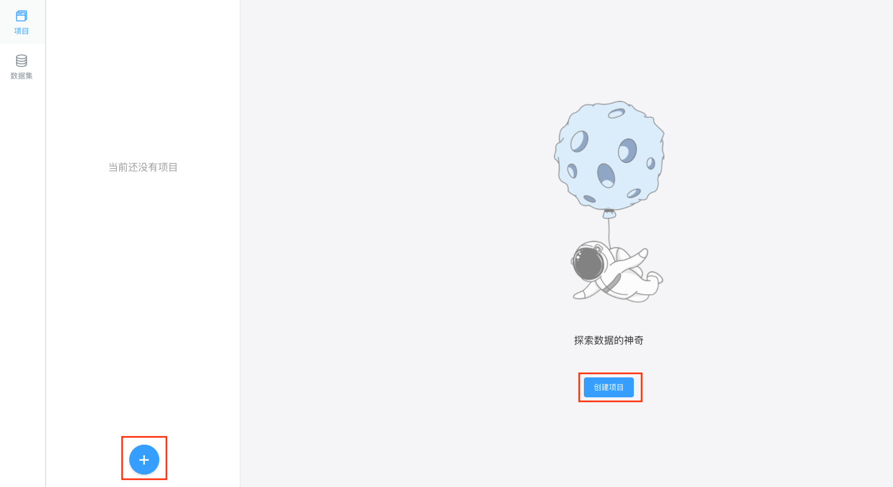

# 数据分析项目
项目是K-Lab的管理单位，每个项目包含不同版本的notebook内容、运行环境、项目描述、挂载数据集等信息。用户可以以项目为单位与他人分享协作。

## 创建项目
在`项目`中可点击蓝色 `+` 进行项目的创建。

* **填写项目名称**：用户对将要创建项目的命名。
* **填写项目描述**：用户对将要创建项目的描述，不超过140字符。
* **添加标签**：用户可以在创建项目时给项目添加标签，将项目归类，便于提交项目后管理员对项目进行筛选及审阅。一个项目只能添加一个标签。详情参见[标签管理]()。
  

* **设置项目环境**：用户创建的项目可以选择初始运行环境，K-Lab支持**Python 2 & 3** 和 **R** 这三种运行环境。用户也可在项目运行时在kernel菜单栏切换环境。
* **添加项目数据集**：用户可以在创建项目时挂载将要使用的数据集。在创建项目之后，如果需要修改数据集，可以在该项目详情页`修改项目属性`进行数据集的添加。
在K-Lab组织版里，用户创建项目时可以选择挂载三种不同的数据集：**组织授权数据集**，**个人创建的私有数据**和**社区公开的数据集资源**。一个项目最多挂载**三个**数据集。挂载的数据集可以在修改项目中进行修改。运行项目时，项目挂载的数据集可以在`/home/kesci/input/`下找到。
  
* 上传本地IPython Notebook文件：K-Lab支持原生```.ipynb```文件，用户可以直接上传本地的Notebook文件导入K-Lab完成后续编写运行。


## 管理项目
用户可以在`项目`中查看和管理个人创建的项目，并完成**运行项目**，**修改项目属性**，**删除项目**，**分享项目**等操作。
 
* **修改项目属性**：用户可以通过该入口修改项目名称、修改项目描述、**修改项目标签**、**修改挂载数据集**。

* **删除项目**：项目一经删除，无法找回。
* **分享项目**：用户可以通过访问链接的方式将项目分享给他人，被分享者可以在浏览器中直接浏览作者的数据分析成果。通过可以通过`Fork`功能运行该项目。项目需要发布至少一个版本后才能被分享。

## 项目版本
用户可以通过发布版本的方式保存阶段性成果。
 
用户可以在项目详情页来一个项目在公开之后，便会生成一个可见版本，每次修改保存并生成新版本后，修改的项目版本才能可见。用户可以在项目详情页对自己的可见项目进行版本管理，如选择一个版本进行查看、运行、修改、保存生成新版本。

## Fork项目
在组织版里，用户一般只能访问自己创建的项目。如果用户被分享了项目链接，则可以查看他人项目详情，Fork并运行他人项目。
* 什么是Fork：用户点击`Fork`后，可以创建一个内容与被Fork项目Notebook内容相同的新项目。在这个项目里，用户可以自由进行编辑和修改操作。
* 如何Fork项目：项目页面点击蓝色的`Fork`按钮。
  
* Fork来源：用户选择Fork的项目名称。
* 项目名称：用户可以更改项目名称。
* 项目描述：用户可以更改项目描述。
